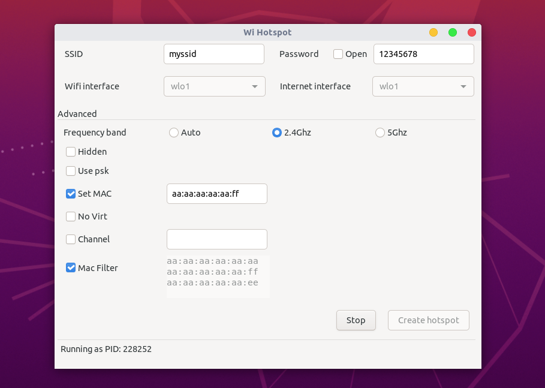

## Linux Wifi Hotspot

[](https://travis-ci.com/lakinduakash/linux-wifi-hotspot)
[](https://gitter.im/linux-wihotspot/community?utm_source=badge&utm_medium=badge&utm_campaign=pr-badge)

### Update
* Config files are wriiten to /etc/wh.config (Previously, configurations were wriiten to home directory as `.wh.config`).
* `.desktop` file is added. So You can start from app launcher
* Use `make` to build instead of `cmake`

### Features
 
* Share your wifi like in Windows - Share wifi on same interface which you are connected to internet.
* Share access point from any network interface
* Includes Both command line and gui.
* Support both 2.4GHz and 5GHz (Need to compatible with your wifi adapter). Ex: You have connected to 5GHz network and share connection with 2.4GHz.
* Select Channel.
* Hide SSID




### [Command line help and documentation](src/scripts/README.md)

### Notes

Sometimes there are troubles with **5Ghz bands** due to some vendor restrictions. If you cannot start hotspot while you are connected to 5Ghz band, Unselect **Auto** and select **2.4Ghz** in frequency selection.

If any problems with **RealTeK Wifi Adapters** see [this](docs/howto/realtek.md)

### Dependencies

#### General
* bash
* util-linux (for getopt)
* procps or procps-ng
* hostapd
* iproute2
* iw
* iwconfig (you only need this if 'iw' can not recognize your adapter)
* haveged (optional)

_Make sure you have those dependencies by typing them in terminal. If any of dependencies fail
install it using your distro's package manager_

#### For 'NATed' or 'None' Internet sharing method
* dnsmasq
* iptables

#### To build from source

* make
* gcc and g++
* build-essential
* pkg-config
* gtk
* libgtk-3-dev

On Ubuntu or debian install dependencies by,

```bash
sudo apt install -y libgtk-3-dev build-essential gcc g++ pkg-config make hostapd
```

## Installation

**Note: If you have installed previous version of this project make sure to uninstall it by checking out to the previous version (v2.1.1 or below).
Also you can use `sudo make clean-old` without checking out to the previous version. After that install the binaries. Otherwise your system might left orphaned binaries and files.**


    git clone https://github.com/lakinduakash/linux-wifi-hotspot
    cd linux-wifi-hotspot
    
    #build binaries
    make
    
    #install
    sudo make install
    
    
    
## Uninstallation
    sudo make uninstall
    
#### To build with cmake (Deprecated)

You need additionally `cmake`
Use the `Makefile.cmake`

    cd linux-wifi-hotspot
    #Build binaries
    make -f Makefile.cmake
    
    #Install
    sudo make -f Makefile.cmake install
    
    #Uninstall
    sudo make -f Makefile.cmake uninstall
    
    
## Running
You can run it from terminal or from application menu.

Run in terminal
 `wihotspot`
    
Tested with Ubuntu from 16.04 to 20.04. If any issue found, file a issue on github.

**credits** - oblique


## Contributing

This project is still new. So you can simply open a issue and send a PR. Also there are some existing issues. Pick one and start contributing.


## License
FreeBSD

Copyright (c) 2013, oblique

Copyright (c) 2020, lakinduakash
